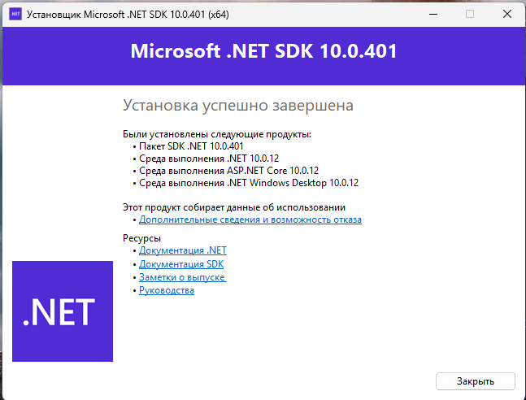
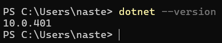
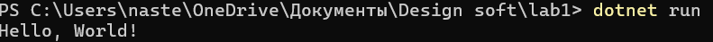
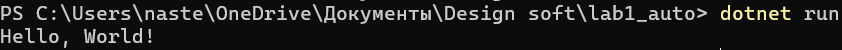

# Лабораторная работа №1. Установка .NET
Каварналы Анастасия IA2403

## Задание

1. Установите .NET на ваш компьютер.

    - Если у вас есть администраторские права, установите .NET просто с официального сайта (поиск в Google), а если таковых не имеется руководствуйтесь инструкциями из видео.

2. Убедитесь, что dotnet доступен для выполнения в командной строке.

3. Создайте новый C# проект, создав файл конфигурации .csproj и файл с кодом Program.cs, согласно инструкциям из видео.

4. Попробуйте создать еще один новый проект, используя команду dotnet new console.

5. Скомпилируйте и выполните программу, используя команду dotnet run.

## Шаг 1: Установка .NET

С официального сайта Microsoft был скачан и установлен `.NET SDK`.


 
 ## Шаг 2: Проверка доступности `dotnet` в командной строке

После установки была открыта командная строка PowerShell.

Для проверки установленной версии .NET была выполнена команда:

```powershell
dotnet --version
```

В результате была отображена версия установленного .NET SDK:

`10.0.401`

Это подтверждает, что .NET установлен и команда dotnet доступна для выполнения в командной строке.



## Шаг 3: Создание нового C# проекта вручную

В папке `lab1` были вручную созданы два файла:

- `lab1.csproj` - файл конфигурации проекта;
- `Program.cs` - файл с кодом программы.

Файл `lab1.csproj` содержит:

```xml
<Project Sdk="Microsoft.NET.Sdk">

  <PropertyGroup>
    <OutputType>Exe</OutputType>
    <TargetFramework>net10.0</TargetFramework>
  </PropertyGroup>

</Project>
```

Файл `Program.cs` содержит:

```csharp
using System;

Console.WriteLine("Hello, World!");
```

## Шаг 4: Запуск проекта

Для компиляции и запуска программы была выполнена команда:

```powershell
dotnet run
```

Программа успешно запустилась и вывела:

`Hello, World!`



## Шаг 5: Создание проекта с помощью команды `dotnet`

Для создания второго консольного проекта была выполнена команда:

```powershell
dotnet new console -n lab1_auto
```

После выполнения команды .NET автоматически создал новый консольный проект с файлами `Program.cs` и `lab1_auto.csproj`.

## Шаг 6: Запуск второго проекта

После создания проекта был выполнен переход в его папку:

```powershell
cd lab1_auto
```

Для запуска программы была выполнена команда:

```powershell
dotnet run
```

В результате программа успешно запустилась и вывела:

`Hello, World!`




