# Лабораторная работа №2. Понимание базового проекта
Каварналы Анастасия IA2403

## Цель

**Необходимо изучить:**

- Артефакты компиляции;
- Папки bin и obj;
- Исходный код;
- Инструкции (statement-ы) программы;
- Порядок выполнения инструкций программы;
- Функции для группировки нескольких инструкций.

## Задание

### 1. Компилирование, выполнимый файл

1. Удалите временные файлы (папки `bin` и `obj`).
   
2. Попытайтесь запустить программу, не компилируя ее перед этим, используя команду `dotnet run --no-build`.
   Почему команда выдает ошибку? Отметьте ваши наблюдения.

   <details>
   <summary>Правильный ответ</summary>
   
   Программа не запустилась, потому что невозможно запустить исходный код программы напрямую.
   Сначала должна произойти *компиляция*, которую флаг `--no-build` предотвращает.
   
   Когда запуск программы совершается командой `dotnet run` без флага `--no-build`,
   программа не скомпилируется заранее.

   Запускается *выполнимый файл* (exe-файл), который получается *в ходе компилирования*.
   Без выполнимого файла нечего будет и запускать.
   </details>
   
3. Используйте команду `dotnet build` чтобы воссоздать выполнимый файл.

4. Найдите выполнимый файл, полученный в ходе компиляции, в папке `bin`.
   Попытайтесь запустить его.

   <details>
   <summary>Двойной клик, появилось окно и сразу закрылось</summary>
   
   Программа выполнилась и сразу закрылась.
   Для того, чтобы окно не закрывалось само, необходимо добавить инструкцию оживания ввода в конец файла.
   
   ```
   Console.WriteLine("Hello world!");
   Console.ReadKey(); // <- эта строчка
   ```
   
   Теперь окно закроется только по нажатию любой кнопки на клавиатуре пользователем.
   </details>

   <details>
   <summary>Как открыть через консоль</summary>
   
   1. Запускаете cmd (есть в видео)
   2. Переходите в папку проекта, выполнив следующие команды.
      ```
      C:
      cd C:/путь-к-проекту
      ```
   3. Теперь нужно перейти к `.exe` файлу, относительно этой папки 
      (`net9.0` заменяется вашей версией .NET, посмотрите название папки),
      используя команду:
      ```
      cd bin/Debug/net9.0
      ```
   4. Теперь выполняем файл, используя команду:
      ```
      .\имя-проекта.exe
      ```
      
   
   Помимо этого, в целом, можно выполнить программу и напрямую из любой папки, по ее помному пути.
   </details>
    

### 2. Базовые инструкции

1. Напечатайте `Hello, Jerry` в консоль, используя изученные инструкции.

2. Создайте функцию, которая печатает:
   ```
   A
   B
   C
   ```
   Выполните ее 3 раза, с задержкой в 0.5 секунды после ее каждого последующего выполнения.

3. Создайте 3 функции (`A`, `B`, `C`).
   Вызовите функции `B` и `C` в функции `A`.
   Вызовите функцию `A` в основной программе несколько раз.

4. Что будет если функцию нигде не вызвать? 
   Выполнится ли она все равно, и когда, если да?

5. Важен ли порядок определения функций? 
   Возможно ли сослаться из функции, определенной раньше в файле, к функции, определенной после?
   Попытайтесь это сделать.

   <details>
   <summary>Что такое "определение"?</summary>
   
   Это кусок кода, где задаются иструкции составляющие эту функцию, и имя функции.
   
   ```
   A(); // вызов функции
   
   // определение функции
   void A()
   {
        Console.WriteLine("Hello");
   }
   ```
   </details>

   ## Ход работы

   ### 1. Компилирование, выполнимый файл

   #### 1.1. Удаление временных файлов

   Сначала были удалены временные папки `bin` и `obj`.

Для удаления использовались команды:

```powershell
Remove-Item bin -Recurse -Force
Remove-Item obj -Recurse -Force
```

После этого содержимое папки проекта было проверено командой:

```powershell
dir
```

Папки `bin` и `obj` отсутствуют.

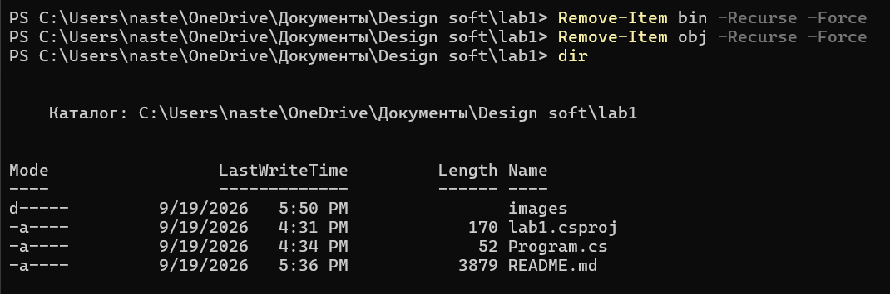

#### 1.2. Запуск программы без компиляции

После удаления папок `bin` и `obj` была выполнена команда:

```powershell
dotnet run --no-build
```

Программа не запустилась. Появилась ошибка о том, что файл `lab1.exe` не найден.

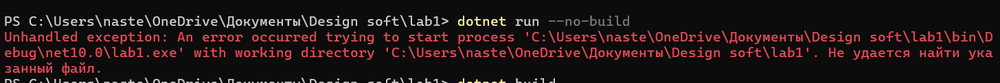

**Вывод:** параметр `--no-build` запрещает выполнять новую сборку проекта. Так как папка `bin` была удалена, готового исполняемого файла не существовало, поэтому программу невозможно было запустить.

#### 1.3. Компиляция проекта

Для повторной сборки проекта была выполнена команда:

```powershell
dotnet build
```

Сборка завершилась успешно.

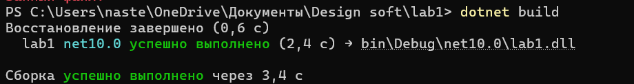

После выполнения `dotnet build` снова были созданы файлы и папки, необходимые для запуска программы.

#### 1.4. Поиск и запуск исполняемого файла

После компиляции был выполнен переход в папку:

```powershell
cd bin\Debug\net10.0
```

Содержимое папки было просмотрено командой:

```powershell
dir
```

В папке появился исполняемый файл:

```text
lab1.exe
```

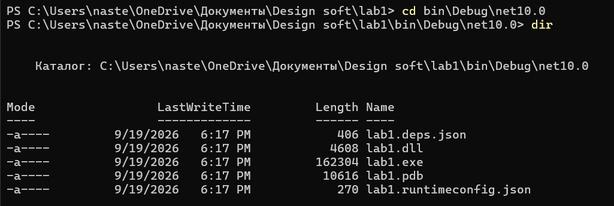

Исполняемый файл был запущен командой:

```powershell
.\lab1.exe
```

Программа успешно выполнилась и вывела:

```text
Hello, World!
```

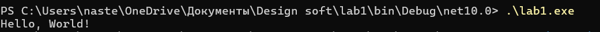

При запуске файла двойным нажатием окно консоли быстро закрывается после выполнения программы.

Чтобы окно не закрывалось сразу, в конец программы была добавлена инструкция:

```csharp
Console.ReadKey();
```

Код программы:

```csharp
using System;

Console.WriteLine("Hello, World!");
Console.ReadKey();
```

После этого программа ожидает нажатия клавиши перед завершением.

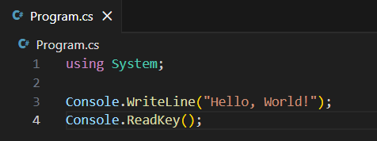

### 2. Базовые инструкции

#### 2.1. Вывод `Hello, Jerry`

Для вывода текста `Hello, Jerry` в консоль была использована инструкция:

```csharp
Console.WriteLine("Hello, Jerry");
```

Полный код программы:

```csharp
using System;

Console.WriteLine("Hello, Jerry");
```

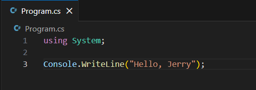

Программа была запущена командой:

```powershell
dotnet run
```

Результат выполнения:

```text
Hello, Jerry
```

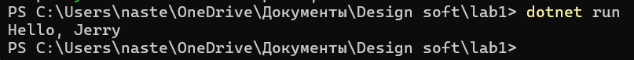

#### 2.2. Функция для вывода A, B, C

Была создана функция `PrintABC()`, которая выводит:

```text
A
B
C
```

Функция вызывается три раза.

Между вызовами добавлена задержка:

```csharp
System.Threading.Thread.Sleep(500);
```

Значение `500` означает 500 миллисекунд, то есть 0,5 секунды.

Код программы:

```csharp
using System;

PrintABC();
System.Threading.Thread.Sleep(500);

PrintABC();
System.Threading.Thread.Sleep(500);

PrintABC();

void PrintABC()
{
    Console.WriteLine("A");
    Console.WriteLine("B");
    Console.WriteLine("C");
}
```

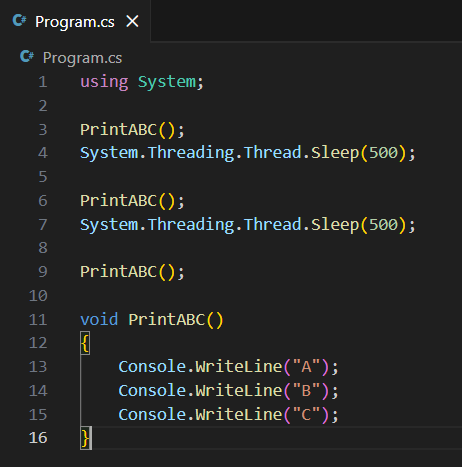

После запуска программы функция выполнилась три раза.

Результат:

```text
A
B
C
A
B
C
A
B
C
```

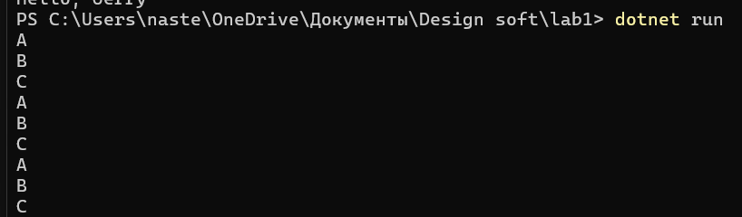

#### 2.3. Функции A, B и C

Были созданы три функции:

- `A()`
- `B()`
- `C()`

Внутри функции `A()` вызываются функции `B()` и `C()`.

Функция `A()` вызывается в основной программе три раза.

Код:

```csharp
using System;

A();
A();
A();

void A()
{
    Console.WriteLine("A");

    B();
    C();
}

void B()
{
    Console.WriteLine("B");
}

void C()
{
    Console.WriteLine("C");
}
```

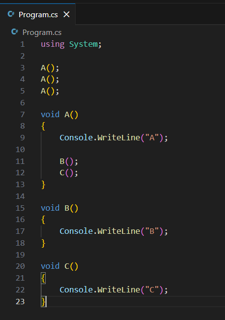

При каждом вызове функции `A()` программа сначала выводит `A`, затем вызывает функцию `B()`, а после неё функцию `C()`.

Результат:

```text
A
B
C
A
B
C
A
B
C
```

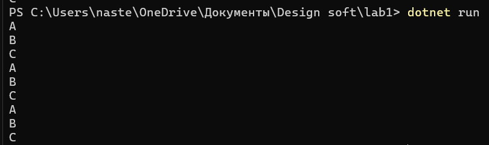

#### 2.4. Что произойдет, если функцию нигде не вызвать

Для проверки была создана функция `A()`, но её вызов в основной программе отсутствует.

Код:

```csharp
using System;

Console.WriteLine("Start");

void A()
{
    Console.WriteLine("Function A");
}
```

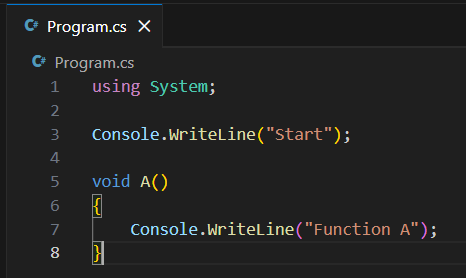

После запуска программы был выведен только текст:

```text
Start
```

Также компилятор показал предупреждение о том, что функция `A` объявлена, но не используется.

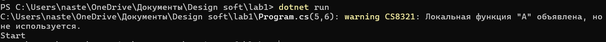

**Вывод:** если функцию определить, но нигде не вызвать, код внутри этой функции не выполнится.

Определение функции:

```csharp
void A()
{
    Console.WriteLine("Function A");
}
```

Вызов функции:

```csharp
A();
```

Определение функции само по себе не запускает её выполнение.

#### 2.5. Порядок определения функций

Было проверено, может ли функция обращаться к другой функции, которая определена ниже в файле.

Код:

```csharp
using System;

A();

void A()
{
    Console.WriteLine("A");
    B();
}

void B()
{
    Console.WriteLine("B");
}
```

В функции `A()` выполняется вызов:

```csharp
B();
```

При этом определение функции `B()` находится ниже в файле.

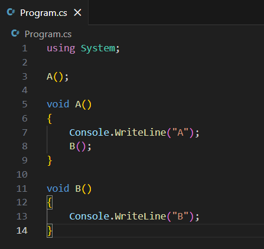

Программа успешно выполнилась.

Результат:

```text
A
B
```

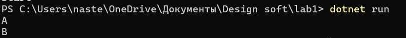

**Вывод:** функция может обращаться к другой функции, даже если её определение находится ниже в файле.


