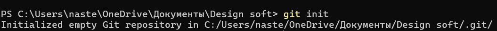
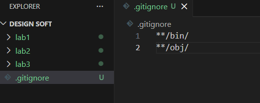
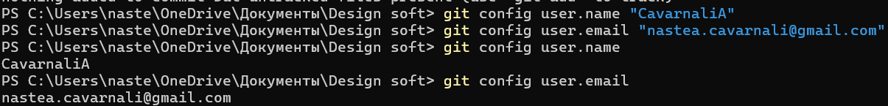
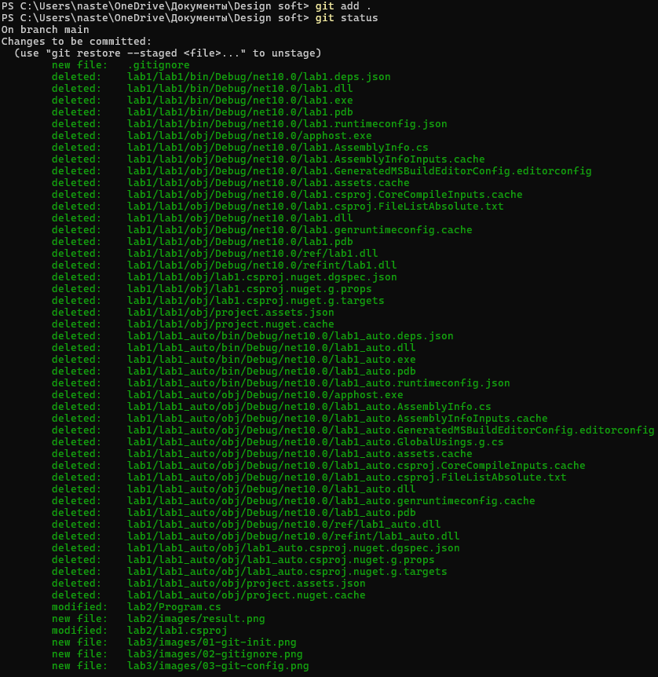
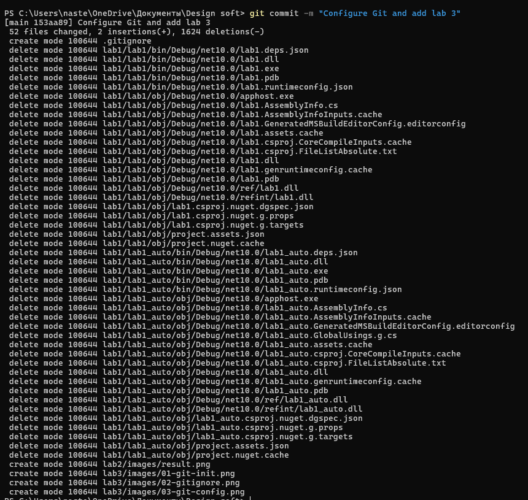
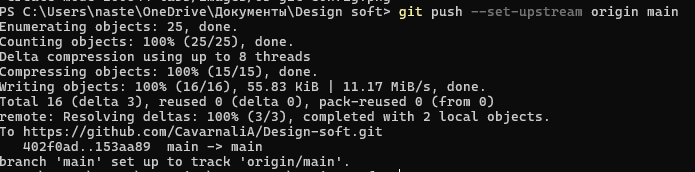

# Лабораторная работа №3. Настройка git
Каварналы Анастасия IA2403

## Задание

1. Инициализируйте git репозиторию для вашего проекта (или для папки, содержащей проект) (команда `git init`).
2. Добавьте файл `.gitignore`, в котором игнорируйте временные или сгенерированные при компиляции файлы.
3. Сконфигурируйте ваши данные в git (команда `git config`).
4. Сделайте коммит со всеми файлами проекта (команды `git add`, `git commit`) и `.gitignore`.
5. Создайте репозиторию на GitHub для лабораторных работ.
6. Свяжите локальнную репозиторию git с GitHub-овской (команды `git remote add` и `git push --set-upstream`).

## Ход работы

### 1. Инициализация Git-репозитория

Работа выполнялась в общей папке с лабораторными работами:

```text
C:\Users\naste\OneDrive\Документы\Design soft
```

В ней находятся папки:

```text
lab1
lab2
lab3
```

Для создания локального Git-репозитория была выполнена команда:

```powershell
git init
```

После выполнения команды Git создал скрытую папку `.git`, которая содержит информацию о локальном репозитории.



## 2. Создание файла `.gitignore`

В корневой папке `Design soft` был создан файл:

```text
.gitignore
```

В него были добавлены правила:

```gitignore
**/bin/
**/obj/
```

Папки `bin` и `obj` содержат временные и сгенерированные файлы, появляющиеся при сборке C#-проекта. Они не должны храниться в Git-репозитории.



Некоторые файлы из папок `bin` и `obj` ранее уже были загружены в GitHub вручную. Поэтому они были удалены из отслеживания Git с помощью команды `git rm --cached`.

Например:

```powershell
git rm -r --cached --ignore-unmatch lab1/lab1/bin
git rm -r --cached --ignore-unmatch lab1/lab1/obj
git rm -r --cached --ignore-unmatch lab1/lab1_auto/bin
git rm -r --cached --ignore-unmatch lab1/lab1_auto/obj
```

При этом сами файлы на компьютере не удаляются. Git только перестаёт их отслеживать.

## 3. Настройка данных пользователя Git

Для настройки имени пользователя была выполнена команда:

```powershell
git config user.name "CavarnaliA"
```

Для настройки электронной почты:

```powershell
git config user.email "nastea.cavarnali@gmail.com"
```

Для проверки настроек были использованы команды:

```powershell
git config user.name
git config user.email
```

После выполнения команд Git выводит сохранённое имя пользователя и email.



## 4. Добавление файлов и создание commit

Для просмотра состояния репозитория использовалась команда:

```powershell
git status
```

После этого все необходимые изменения были добавлены в подготовленную область Git:

```powershell
git add .
```

Команда `git add .` добавляет все изменения из текущего каталога, кроме файлов и папок, указанных в `.gitignore`.

Повторная команда:

```powershell
git status
```

показала подготовленные к commit изменения.



После этого был создан commit:

```powershell
git commit -m "Configure Git and add lab 3"
```

Commit сохраняет текущее состояние файлов в истории Git.



## 5. Создание репозитория на GitHub

Репозиторий для лабораторных работ был создан на GitHub:

```text
CavarnaliA / Design-soft
```

В репозитории хранятся отдельные папки лабораторных работ:

```text
lab1
lab2
lab3
```

Репозиторий был создан ранее через интерфейс GitHub, поэтому на момент настройки локального Git в удалённом репозитории уже находились файлы и существовала история commit-ов.

## 6. Связывание локального репозитория с GitHub

Для связи локального Git-репозитория с существующим репозиторием GitHub была выполнена команда:

```powershell
git remote add origin https://github.com/CavarnaliA/Design-soft.git
```

Для проверки связи использовалась команда:

```powershell
git remote -v
```

После этого Git отображал адрес удалённого репозитория для операций `fetch` и `push`.

Так как в GitHub уже существовали commit-ы, сначала была загружена информация об удалённой истории:

```powershell
git fetch origin
```

Затем локальный репозиторий был связан с существующей веткой `main`:

```powershell
git reset origin/main
```

После подготовки локальных изменений они были отправлены в GitHub командой:

```powershell
git push --set-upstream origin main
```

Параметр `--set-upstream` связывает локальную ветку `main` с удалённой веткой `origin/main`.



После первого связывания для следующих отправок изменений достаточно использовать:

```powershell
git push
```

## Проверка состояния репозитория

Для финальной проверки использовалась команда:

```powershell
git status
```

После синхронизации локального репозитория и GitHub Git показывает:

```text
On branch main
Your branch is up to date with 'origin/main'.

nothing to commit, working tree clean
```

Это означает, что все сохранённые изменения отправлены в GitHub и локальная ветка соответствует удалённой.

